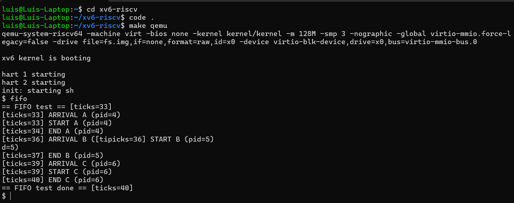

# Planificación FIFO en xv6 (RISC-V)

Este README documenta los cambios realizados para implementar una política de planificación FIFO (First-In, First-Out) en xv6, más un programa de usuario para verificar su funcionamiento.

### Objetivo

- Mantener un tiempo de llegada cada vez que un proceso entra a RUNNABLE.

- En el scheduler(), siempre elegir el proceso RUNNABLE con menor tiempo de llegada (y desempatar por pid para estabilidad).

- Proveer un test de usuario (fifo.c) que evidencie el orden FIFO.
---

### Archivos modificados / agregados

- `kernel/proc.h`

```c
    // ... dentro de struct proc
    uint arrival_time;   // NUEVO: ticks cuando el proceso entra a RUNNABLE
``` 

- `kernel/proc.c`

1. Helper para leer ticks con seguridad (debajo de los includes):
    ```c
    extern uint ticks;
    extern struct spinlock tickslock;

    // Evita re-adquirir tickslock si ya está tomado (holding()).
    static inline uint now_ticks(void) {
        uint t;
        if (holding(&tickslock)) {
            t = ticks;
        } else {
            acquire(&tickslock);
            t = ticks;
            release(&tickslock);
        }
        return t;
    }
    ```
2. Marcar tiempo de llegada en todas las transiciones a RUNNABLE:
    - userinit() (antes de p->state = RUNNABLE;)
    ```c
    p->arrival_time = now_ticks();
    p->state = RUNNABLE;
    ```
    - fork() (hijo, antes de np->state = RUNNABLE;)
    ```c
    np->arrival_time = now_ticks();
    np->state = RUNNABLE;
    ```

    - yield() (antes de p->state = RUNNABLE;)
    ```c
    p->arrival_time = now_ticks();
    p->state = RUNNABLE;
    ```

    - wakeup() (al pasar de SLEEPING a RUNNABLE)
    ```c
    p->arrival_time = ticks;  // (leer 'ticks' directo)
    p->state = RUNNABLE;
    ```

3. scheduler() FIFO: reemplazado para escoger siempre el RUNNABLE con menor arrival_time (desempate por PID). Cuidar locks (nunca tener dos p->lock a la vez) y no usar printf dentro del scheduler.

- `user/fifo.c` (nuevo): prueba mínima para verificar que la planificación FIFO quedó implementada correctamente. Imprime ARRIVAL / START / END con uptime() y debe evidenciar que el orden de START coincide con el orden de ARRIVAL (p. ej., A → B → C), confirmando el comportamiento FIFO.

### Cómo compilar y ejecutar
1. Compilar el sistema:
    ```bash
    make clean
    make qemu
    ```

2. Ejecutar el test dentro de xv6:
    ```bash
    fifo
    ```

3. Se obtiene lo siguiente:




En efecto, el orden de los START coincide con el orden de ARRIVAL → A → B → C.