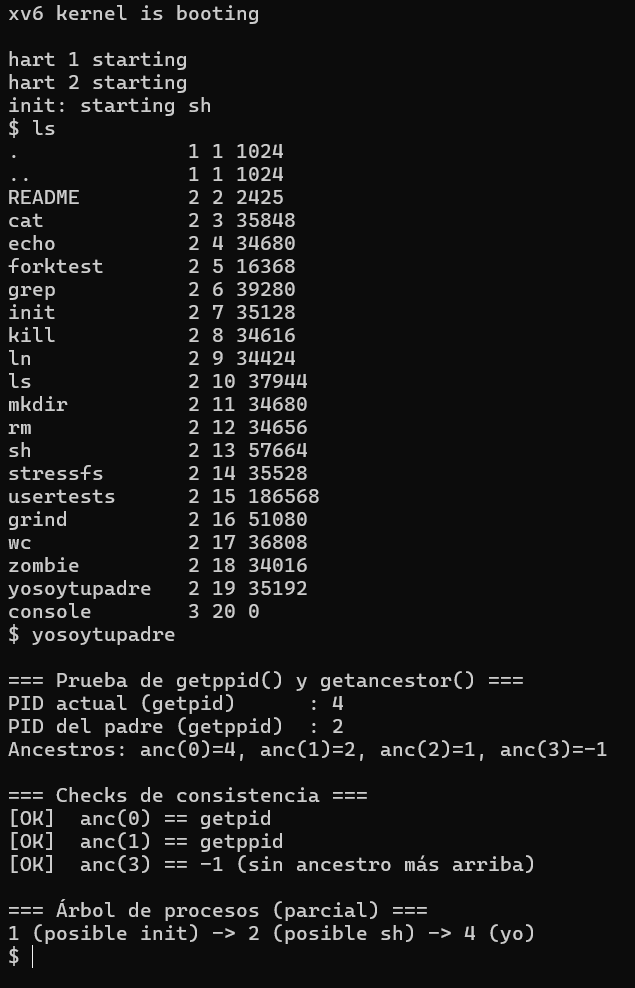

# INFORME – Tarea 1: Implementación de Llamadas al Sistema en xv6

**Nombres: Luis Guerra y Alejandro Mañón**

## 1. Funcionamiento de las llamadas al sistema

- **getppid(void)**: retorna el identificador de proceso (PID) del padre del proceso que la invoca.  
  Ejemplo: si el shell (`sh`) es PID=2 y ejecuta un programa con PID=4, entonces `getppid()` desde el hijo devolverá `2`.  

- **getancestor(int n)**: retorna el PID del ancestro del proceso según el valor de `n`:  
  - `getancestor(0)`: el mismo proceso.  
  - `getancestor(1)`: el padre.  
  - `getancestor(2)`: el abuelo.  
  - Si no existe el ancestro, devuelve `-1`.  

Estas llamadas permiten a un proceso conocer la jerarquía de procesos en xv6. Para verificarlas, implementamos el programa `yosoytupadre.c`, que imprime su PID, el PID del padre y los ancestros en distintos niveles.

### Ejecución de prueba

A continuación, se muestra la salida real al ejecutar `yosoytupadre` en xv6:



### Explicación de los resultados

- El **PID actual** corresponde al proceso `yosoytupadre`.
- El **padre** es siempre el shell (`sh`), porque todos los programas lanzados desde la consola son creados por `sh`.
- El **abuelo** es `init` (PID=1), el primer proceso de usuario que arranca el kernel y que crea al shell.
- Si se consulta un ancestro inexistente, la syscall retorna `-1`.

Esto confirma que las llamadas funcionan correctamente.


## 2. Explicación de las modificaciones realizadas

Para implementar estas llamadas al sistema se siguió el mismo patrón que la syscall existente `getpid`. El trabajo se dividió en varios pasos y archivos:

### 2.1. Definir números de syscall
En `kernel/syscall.h` se agregó:
```c
#define SYS_getppid     22
#define SYS_getancestor 23
```

### 2.2. Declarar y mapear funciones en la tabla de syscalls

En `kernel/syscall.c`:
```c
extern uint64 sys_getppid(void);
extern uint64 sys_getancestor(void);

static uint64 (*syscalls[])(void) = {
  // ...
  [SYS_getppid]     sys_getppid,
  [SYS_getancestor] sys_getancestor,
};
```

### 2.3. Implementación en el kernel

En `kernel/sysproc.c`:
```c
uint64 sys_getppid(void) {
  struct proc *p = myproc();
  return p->parent ? p->parent->pid : -1;
}

uint64
sys_getancestor(void)
{
  int n;
  argint(0, &n);
  if (n < 0)
    return (uint64)-1;

  struct proc *cur = myproc();
  while (n-- > 0 && cur != 0) {
    cur = cur->parent;
  }

  if (cur == 0)
    return (uint64)-1;
    
  return (uint64)cur->pid;
}
```

### 2.4. Prototipos en espacio de usuario

En `user/user.h`:
```c
int getppid(void);
int getancestor(int);
```

### 2.5. Stubs de usuario

En `user/usys.pl`:
```c
entry("getppid");
entry("getancestor");
```

### 2.6. Programa de prueba

Se creó `user/yosoytupadre.c`, un programa que invoca las llamadas al sistema `getppid()` y `getancestor(int)` para verificar su correcto funcionamiento. El programa muestra en pantalla el PID del proceso actual, el PID de su padre y los ancestros hasta el abuelo. Además, valida que los resultados coincidan con lo esperado ([OK]/[FAIL]) y presenta un esquema simple de la jerarquía de procesos (`init → sh → yosoytupadre`). Esto permite comprobar de manera práctica que las nuevas llamadas retornan valores correctos en distintos niveles.

Además, en el Makefile se agregó a la lista UPROGS:

```make
$U/_yosoytupadre
```

### 2.7. Compilación y ejecución

Se recompiló xv6 con:

```bash
make clean && make qemu
```

Y por último, se probó el programa en la shell de xv6, como ya se mostró en la sección 1.

## 3. Dificultades encontradas y cómo se resolvieron.

### 3.1 Archivos a modificar
Al inicio no teníamos claridad en qué archivos debíamos realizar los cambios para implementar nuevas llamadas al sistema. Sabíamos que lo lógico era revisar dónde estaba implementada la syscall `getpid()`, pero no sabíamos exactamente en qué partes del código fuente aparecía.  
Para resolverlo utilizamos el comando:

```bash
find kernel user \( -name '*.c' -o -name '*.h' -o -name '*.S' -o -name '*.pl' \) -print0 | xargs -0 grep -n 'getpid'
```

Esto nos permitió ubicar las referencias de `getpid` en cinco archivos clave:
- `kernel/syscall.h`
- `kernel/syscall.c`
- `kernel/sysproc.c`
- `user/user.h`
- `user/usys.pl`

A partir de ahí, fuimos copiando el patrón de `getpid` y adaptándolo para `getppid` y `getancestor`.


### 3.2 Resultados inesperados en las pruebas

Al probar nuestro programa `yosoytupadre` con la nueva syscall `getancestor`, obtuvimos lo siguiente:

```bash
anc(0)=4, anc(1)=2, anc(2)=1, anc(3)=-1
```

En un principio nos sorprendió, porque esperábamos algo como:

```bash
anc(0)=4, anc(1)=3, anc(2)=2
```
Es decir, pensábamos que los ancestros serían simplemente los PIDs inmediatamente anteriores. Sin embargo, al indagar comprendimos que los PIDs no son correlativos entre padre e hijo, sino que reflejan la jerarquía real de procesos.

- En xv6, el primer proceso de usuario que arranca el kernel es `init`, siempre con PID=1.
- Luego `init` crea el shell (`sh`), que típicamente recibe PID=2.
- Finalmente, cualquier programa que ejecutamos desde la consola (como `yosoytupadre`) es creado por `sh`, por lo que su padre = 2 y su abuelo = 1.


Además, descubrimos que este caso particular se debió a que antes de ejecutar `yosoytupadre` habíamos corrido el comando `ls`, el cual recibió el PID=3. De este modo, al lanzarse `yosoytupadre`, el siguiente número de proceso disponible fue el 4.

De este modo, el resultado `anc(0)=4, anc(1)=2, anc(2)=1` era correcto, aunque inicialmente nos parecía extraño.
La confusión venía de pensar que los PIDs seguían un orden secuencial de “4,3,2…”, cuando en realidad representan una estructura jerárquica:

```bash
init (PID=1)
└─ sh (PID=2)
   └─ yosoytupadre (PID=4)
```

Gracias a esta revisión entendimos que lo que implementamos estaba funcionando bien y que las syscalls devolvían justamente la información de ancestros esperada.