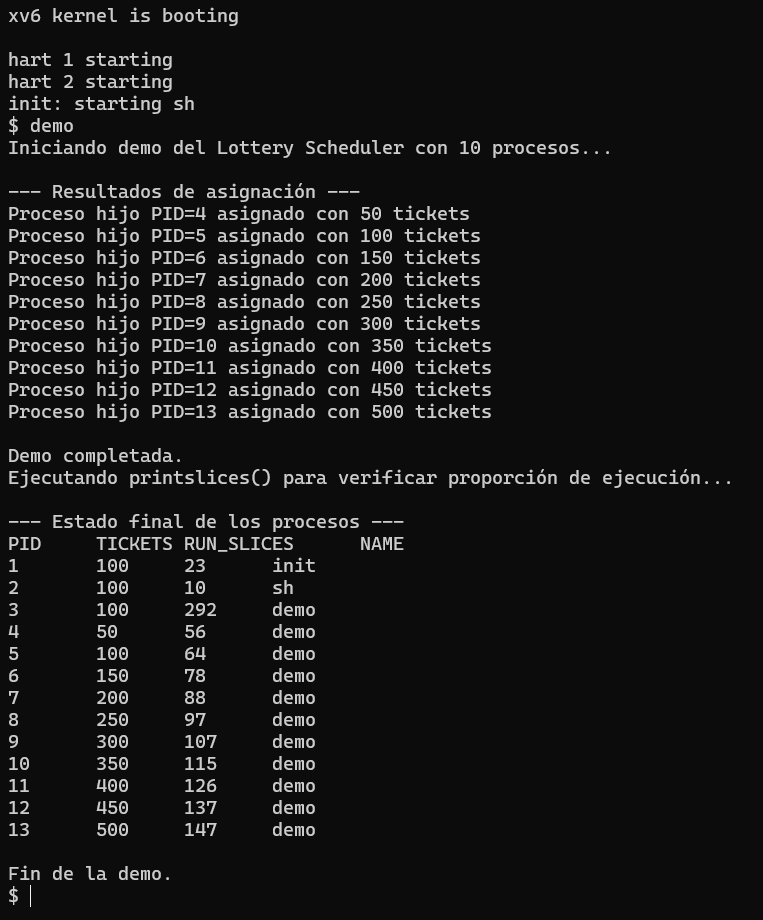

# Tarea 2: Implementación de Scheduler Lottery en xv6

**Nombres:** Luis Guerra y Alejandro Mañón  


## 1. Funcionamiento y lógica de la implementación

El *Lottery Scheduler* implementado en xv6 reemplaza el algoritmo de planificación *Round-Robin* tradicional por un enfoque probabilístico basado en sorteos ponderados.  
En este modelo, cada proceso posee una cantidad de **tickets**, que representan su “probabilidad” de ser elegido para ejecutarse en el siguiente turno del CPU.  
Mientras más tickets tiene un proceso, mayor es la posibilidad de que el scheduler lo seleccione.

### 1.1 Asignación de tickets

Al crearse un nuevo proceso, el sistema asigna 100 tickets por defecto.  
Este valor puede modificarse dinámicamente mediante la syscall `settickets(int n)`.  
Si un proceso intenta asignarse menos de 1 ticket, el sistema ajusta automáticamente el valor a 1, garantizando que todos los procesos tengan al menos una oportunidad de ser elegidos.  

Esta validación también asegura la robustez del scheduler, evitando divisiones por cero o bloqueos del ciclo de planificación.

En el programa de prueba `demo.c`, se crean 10 procesos hijos, a los cuales se les asignan tickets en múltiplos de 50 (desde 50 hasta 500).  
Esto permite observar cómo la cantidad de tickets influye directamente en la probabilidad de ejecución de cada proceso.

### 1.2 Selección del proceso (sorteo)

Durante cada iteración del scheduler, se ejecutan los siguientes pasos:

1. Se recorren todos los procesos y se calcula el total de tickets de aquellos en estado `RUNNABLE`.  
2. Si `total_tickets == 0`, el sistema entra en modo de espera pasiva (wfi) hasta la próxima interrupción de reloj, asegurando que la CPU no quede bloqueada.  
3. Se genera un número aleatorio entre 1 y `total_tickets`, utilizando una función pseudoaleatoria con entropía proveniente del contador global de ticks y del identificador del CPU.  
4. Se recorren nuevamente los procesos, acumulando sus tickets hasta que la suma acumulada supera el número sorteado.  
   El proceso que cumpla esta condición es el **ganador de la lotería** y pasa a ejecutarse.  
5. Cada vez que un proceso es seleccionado, se incrementa su contador `run_slices`, lo que permite medir cuántas veces ha sido elegido por el scheduler.

### 1.3 Ejecución y contabilidad

El proceso ganador ejecuta una porción de CPU hasta que realiza una llamada a `yield()`, `sleep()` o es interrumpido por el reloj del sistema.  
Luego, el scheduler vuelve a realizar una nueva lotería, repitiendo el ciclo indefinidamente.

Para observar los resultados, se implementó una función de contabilidad (`print_slices()`) que imprime una tabla con el estado final de los procesos, mostrando el número de tickets asignados y las veces que cada proceso fue ejecutado.  

A continuación se muestra una captura del resultado obtenido en la consola de xv6:

<p>
  
</p>

### 1.4 Interpretación de resultados

La tabla mostrada representa el estado final de los procesos, indicando la cantidad de tickets asignados y el número de veces que cada uno fue seleccionado para ejecutarse (`RUN_SLICES`).  
Esta métrica permite observar la frecuencia con que cada proceso fue elegido por el *Lottery Scheduler* durante la ejecución.

Es importante destacar que los procesos con **PID 1 (init)**, **PID 2 (sh)** y **PID 3 (demo)** pertenecen al sistema base de xv6.  
En particular, el proceso **PID 3 (demo)** actúa como padre y coordinador: crea los 10 procesos hijos, espera su finalización y ejecuta la función `print_slices()`.  
Por esta razón, su contador de `RUN_SLICES` es considerablemente mayor (292 en este caso), ya que permanece activo durante toda la prueba.  
Sin embargo, **no forma parte del grupo experimental del scheduler** y no debe incluirse en la comparación de equidad.

El análisis relevante corresponde a los **procesos hijos (PID 4 – 13)**, los cuales fueron creados por `demo.c` con distintos valores de tickets (de 50 a 500).  
En ellos se observa claramente el comportamiento esperado:

- Los procesos con **menos tickets** (por ejemplo, 50 o 100) presentan menor cantidad de `RUN_SLICES`.  
- A medida que aumenta el número de tickets, también se incrementa la frecuencia de ejecución.  
- Los procesos con **mayor cantidad de tickets** (400 – 500) son elegidos más veces por el scheduler.

Esta distribución confirma que la probabilidad de selección es **proporcional a la cantidad de tickets asignados**, validando el principio fundamental del *Lottery Scheduling*.  

Aunque los resultados pueden variar ligeramente entre ejecuciones —debido al carácter aleatorio del algoritmo— la tendencia general se mantiene:  
los procesos con más tickets obtienen más CPU, mientras que los de menor cantidad siguen participando, garantizando justicia y balance probabilístico.

En conclusión, los resultados experimentales evidencian que la implementación del *Lottery Scheduler* en xv6 logra una asignación de CPU **justa, proporcional y aleatoria**, cumpliendo correctamente con los objetivos del algoritmo.


## 2. Explicación de las modificaciones realizadas

Para implementar el *Lottery Scheduler* en xv6 se realizaron modificaciones en distintos archivos del kernel y del espacio de usuario. A continuación se describen los cambios clave y su propósito.

### 2.1 Agregar campos `tickets` y `run_slices` en `proc.h`

**Archivo:** `kernel/proc.h`

Se añadieron dos nuevos campos a la estructura `struct proc`:

```c
int tickets;      // cantidad de tickets del proceso (mínimo 1)
int run_slices;   // cantidad de veces que el proceso fue elegido para ejecutarse
```

Estos valores permiten registrar la cantidad de tickets que posee cada proceso (proporcional a su probabilidad de ser seleccionado) y contabilizar cuántas veces fue efectivamente ejecutado por el scheduler.

### 2.2 Inicializar valores por defecto en allocproc()

**Archivo**: `kernel/proc.c`

En la función `allocproc()` se inicializan los campos recién agregados para cada nuevo proceso:

```c
p->tickets = 100;    // valor inicial por defecto
p->run_slices = 0;   // contador de ejecuciones
```

De esta forma, todos los procesos nuevos comienzan con 100 tickets por defecto, asegurando igualdad de condiciones iniciales.


### 2.3 Creación de la syscall settickets(int n)

**Archivos modificados**:

- `kernel/sysproc.c`
- `kernel/syscall.c`
- `kernel/syscall.h`
- `user/user.h`
- `user/usys.pl`

**Cambios realizados**:

1. `sysproc.c` → se implementó la función que modifica los tickets del proceso actual:

```c
uint64
sys_settickets(void)
{
  int n;
  argint(0, &n);               // leer argumento del espacio de usuario

  struct proc *p = myproc();   // proceso actual
  if (n < 1)
    n = 1;                     // mínimo 1 ticket

  p->tickets = n;              // asignar tickets al proceso actual
  return 0;
}
```

2. `syscall.h` → se asignó un nuevo número de syscall:

```c
#define SYS_settickets 22
```


3. `syscall.c` → se declaró y mapeó la nueva syscall:
```c
extern uint64 sys_settickets(void);

...

[SYS_settickets] sys_settickets,
```


4. `user/user.h` → se agregó el prototipo visible para programas de usuario:
```c
int settickets(int);
```

5. `user/usys.pl` → se añadió la entrada correspondiente:
```c
entry("settickets");
```

Esta syscall permite que un proceso modifique dinámicamente su cantidad de tickets de CPU.

### 2.4 Implementación del Lottery Scheduler y Robustez

**Archivo:** `kernel/proc.c`

Se reemplazó el algoritmo *Round-Robin* del scheduler por una versión basada en el principio de *Lottery Scheduling*, donde la probabilidad de que un proceso sea seleccionado para ejecutar es proporcional al número de tickets que posee.  

Para ello, se modificó la función `scheduler()` incorporando:

1. **Cálculo del total de tickets** de los procesos en estado `RUNNABLE`.
2. **Generación de un número aleatorio** dentro del rango `[1, total_tickets]`.
3. **Selección del proceso ganador** mediante la acumulación de tickets hasta alcanzar el número sorteado.
4. **Ejecución y contabilidad**, incrementando el campo `run_slices` cada vez que el proceso es elegido.

Una vez elegido, el proceso pasa a estado `RUNNING` y se ejecuta mediante un cambio de contexto (`swtch()`), conservando el comportamiento cooperativo del sistema.

Además, se implementó una función generadora de números pseudoaleatorios (`random()`) utilizada para determinar el proceso ganador en cada iteración del scheduler.  
Esta función sigue el modelo de un *Linear Congruential Generator (LCG)*, pero incorpora **entropía adicional** proveniente del contador global de tiempo (`ticks`) y del identificador del CPU (`mycpu()`), garantizando que cada ejecución del sistema produzca resultados diferentes y no deterministas.  

```c
// ------------------------------------------------------------
// Generador pseudoaleatorio mejorado para Lottery Scheduler
// ------------------------------------------------------------
extern uint ticks;   // contador global de tiempo definido en trap.c
uint rand_seed = 1;

int random(void) {
  // Linear Congruential Generator (ANSI C) + entropía del sistema
  rand_seed = rand_seed * 1664525 + 1013904223 + ticks + (uint64)mycpu();
  return (rand_seed >> 16) & 0x7FFF;  // devuelve un entero positivo de 15 bits
}
```

Gracias a esta mejora, el Lottery Scheduler evita secuencias fijas y refleja de forma más realista la naturaleza probabilística del algoritmo, donde los resultados varían en cada ejecución manteniendo la proporcionalidad según los tickets asignados.


Ahora, a nivel de implementación, se incorporaron las siguientes medidas de **robustez** para asegurar la estabilidad del sistema:

```c
if (p->state == RUNNABLE && p->tickets > 0)
    total_tickets += p->tickets;

if (total_tickets == 0) {
    asm volatile("wfi");  // espera pasiva sin bloquear CPU
    continue;
}
```

- Se asegura que **solo procesos `RUNNABLE` con al menos un ticket** participen en la lotería.  
- Si no existen procesos listos o si `total_tickets == 0`, el scheduler entra en espera pasiva (`wfi`) y continúa en el siguiente ciclo sin bloquear la CPU.  
- En la syscall `settickets(int n)` se valida que ningún proceso pueda tener menos de un ticket, asegurando que todos mantengan una probabilidad mínima de ejecución.

De esta forma, el algoritmo no solo distribuye el uso del procesador de manera probabilística y justa, sino que también mantiene la estabilidad y robustez del sistema frente a casos extremos o condiciones de inactividad, cumpliendo completamente con los requisitos establecidos en la especificación del Lottery Scheduler.


### 2.5 Contabilidad y Monitoreo

**Archivos modificados:**  
`kernel/proc.h`, `kernel/proc.c`, `kernel/defs.h`, `kernel/sysproc.c`,  
`kernel/syscall.h`, `kernel/syscall.c`, `user/user.h`, `user/usys.pl`

Para medir y validar el comportamiento del *Lottery Scheduler*, se incorporó el campo `run_slices` en la estructura `struct proc`.  
Este contador se incrementa cada vez que un proceso es seleccionado por el scheduler y entra en estado `RUNNING`, registrando cuántas veces fue elegido para ejecutar.  
De esta forma, se puede evaluar la proporcionalidad entre la cantidad de *tickets* asignados y las oportunidades reales de uso de CPU.

Asimismo, se desarrolló una nueva función auxiliar denominada `print_slices()` dentro de `proc.c`, la cual imprime los valores de `PID`, `tickets`, `run_slices` y el nombre de cada proceso.  
Esta función permite visualizar la contabilidad interna de los procesos al finalizar la ejecución, evidenciando cómo los procesos con mayor cantidad de tickets tienden a recibir más tiempo de CPU, validando empíricamente el comportamiento del *Lottery Scheduler*.

```c
// ------------------------------------------------------------
// Función auxiliar para visualizar contabilidad de procesos
// ------------------------------------------------------------
void
print_slices(void)
{
  struct proc *p;

  printf("\n--- Estado final de los procesos ---\n");
  printf("PID\tTICKETS\tRUN_SLICES\tNAME\n");

  for (p = proc; p < &proc[NPROC]; p++) {
    if (p->state != UNUSED) {
      printf("%d\t%d\t%d\t%s\n",
             p->pid, p->tickets, p->run_slices, p->name);
    }
  }
}
```

Para poder invocar esta función desde el espacio de usuario (por ejemplo, en el programa `demo.c`), se implementó una nueva syscall llamada `printslices()`.
Con esta syscall, el usuario puede solicitar al kernel que imprima el estado final de los procesos sin necesidad de modificar el scheduler ni acceder directamente a estructuras internas.

Se realizaron los siguientes cambios para exponerla al espacio de usuario:

- En `defs.h` se declaró la función `print_slices(void)` para que pueda ser utilizada dentro del kernel.
- En `sysproc.c` se implementó la función `sys_printslices()`, que invoca `print_slices()` desde el contexto de sistema.
- En `syscall.h` y `syscall.c` se asignó un nuevo número de syscall y se añadió su mapeo a la tabla de llamadas.
- En `user.h` y `usys.pl` se agregó el prototipo y la entrada de usuario, permitiendo su invocación directa desde programas como `demo.c`. 

De esta forma, el proceso padre en demo.c puede ejecutar la instrucción:

```c
printslices();
```
al final de la simulación, obteniendo en pantalla la tabla de contabilidad que muestra la relación entre los tickets asignados y los `RUN_SLICES` efectivamente acumulados.

Esto completa el mecanismo de contabilidad y monitoreo, cumpliendo con el requerimiento de evidenciar la proporcionalidad entre los tickets de cada proceso y su uso real del CPU dentro del Lottery Scheduler.


### 2.6 Programa de Prueba `demo.c`

**Archivos modificados:** `user/demo.c`, `Makefile`

El programa cumple la función de **validar empíricamente el funcionamiento del Lottery Scheduler**, reproduciendo los pasos solicitados en la especificación de la tarea:

1. Crear **N procesos (mínimo 10)** usando `fork()`.  
2. Asignar **tickets distintos** a cada proceso mediante la syscall `settickets(50 * (i + 1))`.  
3. Ejecutar una **carga intensiva de CPU** y verificar la proporcionalidad entre tickets y uso de CPU mediante `print_slices()`.

Se desarrolló un programa de usuario denominado `demo.c` que crea múltiples procesos (10 en total) mediante llamadas a `fork()`.  
A cada proceso se le asigna un número distinto de tickets utilizando la syscall `settickets(int n)`.  
Los procesos realizan una carga de trabajo intensiva en CPU, lo que permite al scheduler distribuir equitativamente el uso del procesador de acuerdo con las probabilidades definidas por los tickets. 

Durante la ejecución, el proceso padre muestra los tickets asignados a cada hijo y, al finalizar, invoca la función `print_slices()` para mostrar la contabilidad final de todos los procesos.  
En dicha salida, se observa cómo los procesos con mayor cantidad de tickets son seleccionados con mayor frecuencia, validando la proporcionalidad entre los tickets y los `run_slices` acumulados.  

De esta forma, el programa `demo.c` permite **verificar experimentalmente el comportamiento justo y probabilístico** del *Lottery Scheduler*, demostrando que los procesos con más tickets reciben proporcionalmente más CPU sin excluir a los de menor prioridad.


## 3. Dificultades encontradas y soluciones implementadas

Durante la implementación y prueba del *Lottery Scheduler* se presentaron diversas dificultades, tanto técnicas como de comportamiento, las cuales se detallan a continuación junto con las soluciones aplicadas.


### 3.1. Interferencia de salidas concurrentes en la consola

Una de las principales dificultades surgió durante la ejecución del programa de prueba `demo.c`.  
Al crear múltiples procesos hijos que imprimían simultáneamente mediante `printf()`, la salida en la consola de xv6 aparecía distorsionada o con caracteres mezclados (por ejemplo, líneas superpuestas o texto corrupto).  

Este comportamiento no se debía a un error en la implementación, sino a una limitación intrínseca de xv6: la consola (`uart.c`) **no posee mecanismos de sincronización ni exclusión mutua entre procesos concurrentes**.  
Por tanto, cuando varios procesos escriben al mismo tiempo en la salida estándar, sus mensajes se intercalan a nivel de carácter, generando texto ilegible.

**Solución implementada:**  
Se modificó el programa `demo.c` para que **solo el proceso padre realice las impresiones en consola**, mientras que los procesos hijos ejecutan su carga de CPU en segundo plano sin imprimir.  
De esta manera, se evita la escritura simultánea en el dispositivo de salida, logrando una ejecución más limpia, ordenada y reproducible.  

Además, se reorganizó la estructura del programa para que las impresiones se realicen **en tres momentos bien definidos**:

1. **Inicio:** mensaje de arranque del experimento.  
2. **Después de la creación de procesos:** impresión del bloque  
   `--- Resultados de asignación ---` con los tickets asignados.  
3. **Final:** ejecución de `print_slices()` para mostrar la tabla consolidada con los valores de `TICKETS` y `RUN_SLICES`.

Esta modificación no afecta el comportamiento del scheduler ni la equidad de asignación de CPU, ya que los procesos hijos mantienen su carga de trabajo normal.  
El cambio únicamente organiza la salida estándar, mejorando la legibilidad y la trazabilidad del resultado final.

---

### 3.2. Resultados deterministas en la función aleatoria del scheduler

Durante las primeras pruebas del *Lottery Scheduler*, se observó que los resultados del contador `RUN_SLICES` eran **idénticos en cada ejecución**, lo cual indicaba que el generador de números aleatorios estaba produciendo una secuencia fija.  
Esto provocaba que los procesos fueran seleccionados en el mismo orden en todas las ejecuciones, afectando la naturaleza probabilística esperada del algoritmo.

**Causa del problema:**  
La función `random()` inicial utilizaba un *seed* constante (`rand_seed = 1`), sin incorporar ninguna fuente de entropía variable del sistema, lo que hacía que la secuencia se repitiera exactamente cada vez que se iniciaba xv6.

**Solución implementada:**  
Se mejoró el generador aleatorio añadiendo **entropía dinámica** proveniente del contador global de ticks (`ticks`) y del identificador del CPU activo (`mycpu()`).  
De esta forma, cada ejecución parte de un estado diferente, garantizando resultados variables y reflejando con mayor realismo el comportamiento estocástico del *Lottery Scheduler*.

```c
extern uint ticks;   // contador global de tiempo definido en trap.c
uint rand_seed = 1;

int random(void) {
  // Linear Congruential Generator (ANSI C) + entropía del sistema
  rand_seed = rand_seed * 1664525 + 1013904223 + ticks + (uint64)mycpu();
  return (rand_seed >> 16) & 0x7FFF;  // devuelve un entero positivo de 15 bits
}
```

Con este cambio, cada ejecución del programa `demo` produce una distribución diferente de `RUN_SLICES`, conservando la proporcionalidad entre los tickets asignados y el tiempo efectivo de CPU, pero variando naturalmente por efecto del azar.

### 3.3. Dependencia del archivo `README` en el Makefile

Durante la compilación, se detectó un error del tipo:

```bash
make: *** No rule to make target 'README', needed by 'fs.img'. Stop.
```

Inicialmente se asumió que el problema se debía a la ausencia del archivo `README`, pero en realidad el error se produjo porque el archivo `README` original de xv6 había sido eliminado.
Este archivo venía incluido de manera predeterminada en la raíz del proyecto y contiene información sobre los autores y la estructura de xv6, además de ser una dependencia obligatoria en el `Makefile` para construir la imagen del sistema de archivos (`fs.img`).

En el contexto de la tarea, se requería entregar un informe en formato Markdown bajo el nombre `README.md`.
Al reemplazar el `README` original por este nuevo archivo, la regla del Makefile no pudo cumplirse, generando el error anterior.


**Solución implementada:**  
Se restauró el archivo `README` original de xv6, manteniéndolo en la raíz del proyecto con su contenido intacto, y simultáneamente se conservó el archivo `README.md` como documento de entrega.

De esta forma:

- El sistema de compilación volvió a funcionar correctamente, al encontrarse el `README` requerido por el `Makefile`.

- Se mantuvo el `README.md` con la documentación y el informe del proyecto sin interferir con la compilación.

Esta decisión permitió cumplir tanto con los requisitos de la tarea como con la estructura original del entorno de compilación de xv6.


## 4. Posibles problemas de este tipo de Scheduler (Lottery Scheduling)

El *Lottery Scheduling* es un algoritmo innovador que asigna el uso del CPU de forma probabilística, otorgando a cada proceso una cantidad de tickets que representan su “probabilidad” de ser elegido para ejecutar. Aunque este enfoque promueve la equidad y ofrece gran flexibilidad, también presenta limitaciones prácticas que deben considerarse para comprender su comportamiento real frente a otros algoritmos de planificación. A continuación se describen los principales problemas y un contraste con *Stride Scheduling*.

### 4.1 Variabilidad y falta de determinismo

Uno de los principales inconvenientes del *Lottery Scheduler* es su dependencia del azar. Aunque los procesos con más tickets tienen mayor probabilidad de ser elegidos, el resultado de cada sorteo es impredecible. En ejecuciones cortas, un proceso con pocos tickets puede ser seleccionado varias veces seguidas por simple casualidad, mientras que uno con muchos tickets podría esperar más tiempo del esperado. Esto introduce una variabilidad natural en la asignación de CPU que impide garantizar resultados exactos por intervalo y dificulta la reproducibilidad. En contextos donde se requieren tiempos de respuesta estrictos, como sistemas de control o tiempo real, esta falta de determinismo es una desventaja significativa.

### 4.2 Falta de garantías de tiempo de respuesta

El carácter probabilístico del algoritmo hace imposible establecer un tiempo máximo de espera. Un proceso con tickets válidos puede quedar temporalmente sin ser seleccionado, sufriendo *starvation* por simple azar. Si bien a largo plazo la probabilidad asegura que todos reciban CPU de manera proporcional, en ventanas cortas no se garantiza equidad temporal ni tiempos de servicio constantes. Esto lo vuelve menos adecuado para procesos interactivos o tareas críticas donde la latencia debe ser predecible.

### 4.3 Complejidad en la asignación y manipulación de tickets

Definir la cantidad apropiada de tickets para cada proceso no es trivial. Si la asignación se realiza de manera manual, depende de juicios subjetivos o pruebas empíricas; si se hace de forma automática, el sistema debe implementar un mecanismo adicional para ajustar dinámicamente las proporciones de tickets según carga, prioridad o tiempo de ejecución. Además, el *Lottery Scheduler* introduce tres mecanismos que amplían su flexibilidad pero aumentan su complejidad: **Ticket currency**, que permite a cada usuario definir su propia “moneda” de tickets (requiriendo conversión global y control de equilibrio); **Ticket transfer**, que autoriza transferir tickets entre procesos, útil en esquemas cliente-servidor pero potencialmente riesgosa si se abusa; y **Ticket inflation**, que permite inflar temporalmente los tickets de un proceso para acelerar su ejecución, aplicable solo en entornos confiables. Estos mecanismos mejoran la adaptabilidad, pero pueden complicar la gestión de prioridades y generar desequilibrios si no se regulan correctamente.

### 4.4 Sobrecarga computacional y eficiencia

El proceso de selección requiere recorrer todos los procesos en estado `RUNNABLE` para sumar sus tickets, generar un número aleatorio y volver a recorrerlos acumulando hasta encontrar el ganador. Este enfoque tiene una complejidad O(n) en cada ciclo de planificación, lo que puede volverse costoso en sistemas con muchos procesos activos. A diferencia de algoritmos más simples como *Round-Robin*, que operan en O(1), el *Lottery Scheduler* demanda operaciones adicionales de cálculo y generación aleatoria en cada interrupción de reloj. Si bien el impacto es marginal en entornos pequeños o educativos, en sistemas de producción de alta carga puede degradar el rendimiento del planificador.

### 4.5 Escalabilidad y sincronización en sistemas multiprocesador

En arquitecturas con múltiples núcleos (SMP), mantener sincronizados los conteos de tickets y la generación aleatoria global introduce problemas de contención. Cada CPU debería compartir información sobre los procesos listos y sus tickets, lo que requiere mecanismos de exclusión mutua o regiones críticas. Estas operaciones aumentan el tiempo de planificación y reducen la eficiencia del paralelismo. Además, si cada CPU realiza su propia lotería local, la asignación global puede perder proporcionalidad. Por ello, este algoritmo resulta más adecuado para entornos monoprocesador o como herramienta experimental.

### 4.6 Contraste con *Stride Scheduling*

El *Stride Scheduler* surge como una versión determinista del *Lottery Scheduler*, manteniendo la idea de proporcionalidad de tickets pero reemplazando el sorteo por un cálculo exacto. Cada proceso tiene un **stride** (paso), calculado como `stride = GRAN_NUM / tickets`. El scheduler siempre selecciona el proceso con el menor contador de pasos (*pass value*) y, tras ejecutarlo, incrementa su contador en su stride. Así, los procesos con más tickets avanzan más lentamente y son elegidos con mayor frecuencia, garantizando una distribución proporcional y reproducible. No requiere aleatoriedad y ofrece resultados idénticos en cada ejecución, lo que facilita la depuración y la previsibilidad. Sin embargo, tiene una limitación importante: cuando **llegan nuevos procesos dinámicamente**, los contadores (*pass values*) de los procesos existentes pueden quedar desbalanceados, rompiendo la proporcionalidad momentánea. En cambio, el *Lottery Scheduler* maneja naturalmente la llegada y salida dinámica de procesos, ya que cada nuevo proceso simplemente entra al siguiente sorteo con su cantidad de tickets, sin necesidad de ajustes adicionales.

| Característica | Lottery Scheduling | Stride Scheduling |
|----------------|-------------------|------------------|
| Naturaleza | Probabilístico | Determinista |
| Selección | Sorteo aleatorio proporcional a los tickets | Proceso con menor contador de pasos (`pass`) |
| Equidad | Aproximada en el corto plazo, proporcional en promedio | Exacta y reproducible |
| Llegada dinámica de procesos | Se maneja naturalmente sin reajustes | Puede requerir reequilibrar contadores |
| Sobrecarga | Mayor por generación aleatoria | Menor, pero más rígido ante cambios |
| Aplicación típica | Entornos educativos o sistemas con carga dinámica | Sistemas controlados o con procesos estables |

### Conclusión

El *Lottery Scheduler* representa un enfoque flexible, justo y simple para distribuir la CPU, especialmente útil cuando los procesos entran y salen de forma dinámica, ya que ajusta la probabilidad de ejecución en tiempo real sin necesidad de recalcular estados previos. No obstante, su naturaleza aleatoria genera resultados variables, lo que reduce la predictibilidad y dificulta la depuración. Por su parte, *Stride Scheduling* elimina la aleatoriedad y asegura una asignación proporcional exacta, siendo más adecuado para entornos deterministas o de carga estable. En síntesis, *Lottery* es ideal para sistemas donde la adaptabilidad y la simplicidad son prioritarias, mientras que *Stride* resulta preferible cuando se requiere precisión, estabilidad y trazabilidad en la planificación.

